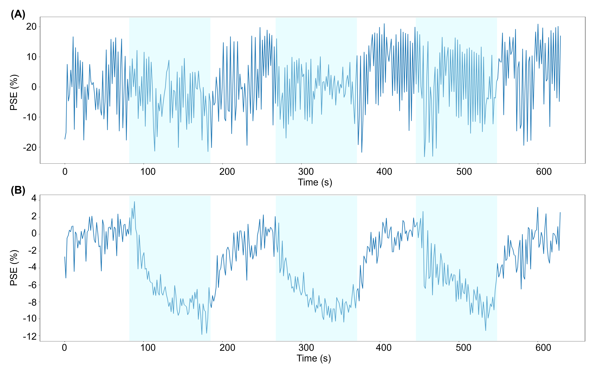

# Independent component analysis (ICA) applied to dynamic oxygen-enhanced MRI (OE-MRI) for robust functional lung imaging at 3 T

**Sarah Needleman, University College London, 2023**


## Abstract
**Purpose:** Dynamic lung oxygen-enhanced MRI (OE-MRI) is challenging due to the presence of confounding signals and poor signal-to-noise ratio, particularly at 3 T. We have created a robust pipeline utilizing independent component analysis (ICA) to automatically extract the oxygen-induced signal change from confounding factors to improve the accuracy and sensitivity of lung OE-MRI.

**Methods:** Dynamic OE-MRI was performed on healthy participants using a dual-echo multi-slice spoiled gradient echo sequence at 3 T and cyclical gas delivery. ICA was applied to each echo within a thoracic mask. The ICA component relating to the oxygen-enhancement signal was automatically identified using correlation analysis. The oxygen-enhancement component was reconstructed, and the percentage signal enhancement (PSE) was calculated. The lung PSE of current smokers was compared with non-smokers; scan-rescan repeatability, ICA pipeline repeatability, and reproducibility between two vendors, were assessed.

**Results:** ICA successfully extracted a consistent oxygen-enhancement component for all participants. Lung tissue and oxygenated blood displayed opposite oxygen-induced signal enhancements. A significant difference in PSE was observed between the lungs of current smokers and non-smokers. The scan-rescan repeatability, and the ICA pipeline repeatability, were good.

**Conclusion:** The developed pipeline demonstrated sensitivity to the signal enhancements of the lung tissue and oxygenated blood at 3 T. The difference in lung PSE between current smokers and non-smokers indicates a likely sensitivity to lung function alterations that may be seen in mild pathology, supporting future use of our methods in patient studies.

## Publication
[**Independent component analysis (ICA) applied to dynamic oxygen-enhanced MRI (OE-MRI) for robust functional lung imaging at 3 T**](https://onlinelibrary.wiley.com/doi/10.1002/mrm.29912)

Sarah H. Needleman, Mina Kim, Jamie R. McClelland, Josephine H. Naish, Marta Tibiletti, James P. B. O’Connor, Geoff J. M. Parker

Citation: Needleman SH, Kim M, McClelland JR, et al. Independent component analysis (ICA) applied to dynamic oxygen-enhanced MRI (OE-MRI) for robust functional lung imaging at 3 T. Magn Reson Med. 2024; 91: 955-971. doi: 10.1002/mrm.29912

Bibtex entry:
```
@article{https://doi.org/10.1002/mrm.29912,
author = {Needleman, Sarah H. and Kim, Mina and McClelland, Jamie R. and Naish, Josephine H. and Tibiletti, Marta and O'Connor, James P. B. and Parker, Geoff J. M.},
title = {Independent component analysis (ICA) applied to dynamic oxygen-enhanced MRI (OE-MRI) for robust functional lung imaging at 3 T},
journal = {Magnetic Resonance in Medicine},
volume = {91},
number = {3},
pages = {955-971},
keywords = {dynamic, lung function, oxygenation, oxygen-enhanced MRI, repeatability, susceptibility contrast},
doi = {https://doi.org/10.1002/mrm.29912},
url = {https://onlinelibrary.wiley.com/doi/abs/10.1002/mrm.29912},
eprint = {https://onlinelibrary.wiley.com/doi/pdf/10.1002/mrm.29912},
year = {2024}
}
```
The figures on this page were adapted from the above publication.

## Image registration algorithm and implementation of ICA
Registration (motion-correction) of the dynamic images was performed using the deformable image registration software [NiftyReg](http://cmictig.cs.ucl.ac.uk/wiki/index.php/NiftyReg) (version 1.5.71) [^1]. The following parameters were used in NiftyReg:
```
-be 0.005 --lncc -5 -sx -3 -sy -3 -vel
```
Within the pipeline, temporal ICA is applied using [scikit-learn FastICA](https://scikit-learn.org/stable/modules/generated/sklearn.decomposition.FastICA.html) (version 1.2.2) [^2][^3].
For further details, please see the above publication.





### References

[^1]: Modat M, Ridgway GR, Taylor ZA, et al. Fast free-form deformation using graphics processing units. _Comput Methods Programs Biomed._ 2010;98(3):278-284. doi:10.1016/j.cmpb.2009.09.002

[^2]: Pedregosa F, Varoquaux G, Gramfort A, et al. Scikit-learn: Machine Learning in Python. _J Mach Learn Res._ 2011;12(85):2825-2830. http://jmlr.org/papers/v12/pedregosa11a.html

[^3]: Hyvärinen A, Oja E. A Fast Fixed-Point Algorithm for Independent Component Analysis. _Neural Comput._ 1997;9:1483-1492.
